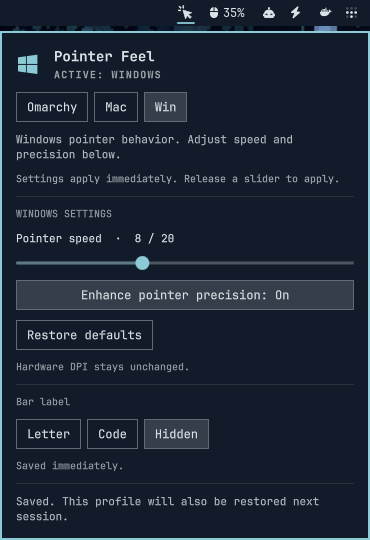

# Pointer Feel

A vendor-neutral, English-language pointer profile panel for Omarchy/Hyprland.

**Version 1.0.0:** Omarchy / Mac / Win switching, profile-specific settings,
verified changes, 15-second trials, Keep/Revert, and session persistence.
**Mac is an experimental Sequoia measured reference.**



## Use the panel

Click the **OMA / MAC / WIN** widget in the right side of the bar.
The **filled click cursor** icon (pointer and three short rays) follows the bar's theme
color and scale, independently of the icon font.
The panel header shows the active profile's Omarchy, Apple, or Windows logo
beside **Pointer Feel**, including during trials and after reverting.
**Bar label** offers **Letter** (O / M / W), **Code** (OMA / MAC / WIN), or
**Hidden** (icon only). Hidden keeps the widget clickable and the profile tooltip
available; a trial still highlights the icon. Required setup still shows **Setup**.
Code is the default. This appearance preference saves immediately and survives
shell restarts and profile changes; it does not need Keep.

Choose **Omarchy**, **Mac**, or **Win** to try a profile. Select **Keep** within 15 seconds
to save it, or **Revert** to return immediately. Closing the panel does not save
the trial; rollback continues independently of the panel.

All settings apply directly: release a slider, click a toggle, or use the keyboard.
There is no separate Try button. You can keep tuning or switch styles during a
trial; each applied change restarts the 15-second timer. **Keep** saves the changes
across those styles; **Revert** returns to the state before the entire trial.
**Restore defaults** resets the selected profile through the same trial/Keep/Revert
flow, preserving settings in the other profiles. Tab navigates controls; Escape
closes the panel.

| Profile | Default settings |
|---|---|
| Omarchy | System acceleration, sensitivity 0, scroll 1×, natural scrolling off, left primary button |
| Mac | Sequoia reference tracking 4/10, natural scrolling on, left primary button |
| Win | Speed 10/20, Enhance pointer precision on |

These are the managed profile defaults. Omarchy uses native global input defaults;
existing per-device overrides still take precedence.

| Profile | Meaning |
|---|---|
| Omarchy | Native System/Adaptive/Flat acceleration, sensitivity, scroll speed, natural scrolling, and left-handed buttons |
| Mac | Experimental Sequoia 15.3.2 reference: tracking 1–10, natural scrolling, and primary button |
| Win | The existing Windows pointer engine, with adjustable speed and EPP |

Each active profile shows its own controls. The Omarchy acceleration buttons,
sensitivity (-1 to +1), scroll speed (0.1–5×), natural scrolling, and left-handed
buttons apply immediately through a verified trial. **System**
uses libinput's device-default acceleration profile. **Adaptive** and **Flat**
select those native profiles explicitly.

Omarchy, Mac, and Windows preferences are stored independently. Choosing a profile
restores its settings, including any adjustments in the current trial. Hardware DPI is never changed. No manufacturer
utility, mouse brand, sensor DPI, or report rate is assumed.

Omarchy edits shared Hyprland input defaults. Per-device overrides still take
precedence, and the shared acceleration/sensitivity settings can affect touchpads
that inherit them. Keyboard, device rules, and touchpad-specific options remain
in the user's config. Returning to Win removes this plugin's native overrides,
restoring the underlying user configuration before applying Windows speed/EPP.
These are native [Hyprland input options](https://wiki.hypr.land/Configuring/Basics/Variables/#input),
not a simulated Omarchy curve. The earlier “Default” profile is now “Omarchy”.

## Mac reference

The Mac panel uses ten measured tracking levels from libpointing's macOS Sequoia
15.3.2 dataset. Releasing the tracking slider applies the value immediately. Natural
scrolling and primary-button choices are saved with that profile.

The reference was measured at 400 DPI / 125 Hz. It does not infer or change your
hardware DPI or rate, and does not reproduce Mac wheel momentum. Exact macOS
parity across hardware is unverified. See [model, evidence, and license](docs/MAC-REFERENCE.md).

Both native modules are built by the installer. Their Hyprland ABI checks remain
enforced; an incompatible compositor never loads a module by bypassing a check.
Do not add separate native plugin startup loaders.

## Current compatibility

The backend handles supported **physical relative mice** without checking their
brand: wired, wireless receiver, and Bluetooth mice can use the same input path.
This is architectural coverage, not a claim that every model has been tested.
Touchpads, virtual pointers, tablets, and unsupported fractional/rotated input
keep their native behavior. A per-device profile selector is not implemented.

This release supports **Omarchy with Hyprland 0.56.2 and Lua configuration**.
It is not a GNOME/KDE/Niri plugin. Unknown Hyprland versions are rejected before
package installation. Compatibility with other Hyprland releases is not claimed.
The Windows native adapter and its 0.56 compatibility patch are bundled alongside
the unchanged, pinned Windows engine; no pre-existing Windows checkout is needed.

## Install or update

The repository is currently private; installation requires repository access.
Add the plugin from its repository:

```sh
omarchy plugin add https://github.com/ilysorc/omarchy-pointer-feel.git --enable
```

Open **Pointer Feel** in the bar and click **Install / Repair**. Omarchy does not
run third-party install hooks automatically, so this first-use action starts the
complete installer, including any missing system packages and both native modules.

From a clone or extracted source archive, run one command as your desktop user:

```sh
./install.sh
```

The installer asks once before setup. It checks the environment, installs missing
Arch packages, builds **both** native modules, installs the frontend/controller,
adds the managed Lua/startup integration, verifies all profiles, and restores
your previously active profile and preferences. Complete any active Keep/Revert
trial first. Hardware DPI is not touched.

Adding/enabling the repository opens **Set up Pointer Feel** when
components are missing. Click **Install / Repair** to accept package/configuration
changes. That uses the same installer in a detached worker; closing the panel or
reloading the shell does not terminate it. The normal controls open only when the
installed components match the source and running Hyprland ABI.

Missing system packages: Python, Git, coreutils, GCC, Make, CMake, pkgconf and Polkit.
Hyprland's matching headers/development metadata are provided by the Arch Hyprland
package. An outdated running session or mismatched headers requires completing
the Omarchy update and logging in again. No partial `pacman -Sy` update is run.
Only the package manager runs with administrative privileges: terminal setup uses
sudo; setup from the panel uses Omarchy's Polkit password dialog. Native builds
run as your normal user. No AUR helper, root daemon, passwordless policy, or kernel
module is installed. Test libraries such as GTest are not user dependencies.
The first install needs access to configured package repositories if packages are
missing; native sources are bundled and need no network checkout.

Useful commands:

```sh
./install.sh --plan            # read-only environment/package plan
./install.sh --status          # read-only readiness JSON
./install.sh --yes             # accept setup; OS authentication still applies
pointer-feel setup             # rerun/repair the installed source bundle
pointer-feel uninstall         # fully remove the integration
```

Updates use the same installer. A source or Hyprland ABI change opens setup again;
existing preferences remain intact. A matching installation is a no-op build.
Git-managed marketplace checkouts are updated by `omarchy plugin update`; the
installer never overwrites a different Git checkout. Local development copies
are copied as a complete, buildable source bundle. Legacy helper scripts now
forward to this installer.

Build errors and rejected authentication leave the working integration untouched.
During activation, a persistent journal records file backups before changes;
a failed load rolls back, and the next setup recovers an interrupted transaction.
The installer holds a lock to prevent concurrent installations. System packages
successfully installed before a later error stay installed.
Setup logs from the panel: `~/.local/state/pointer-feel/setup.log`.

The installer preserves personal input settings, appends an idempotent managed
include, and adds a startup restore command. It can adopt the common
`windows-pointer on` startup helper, irrespective of mouse hardware. Other
plugin loaders must not load the same backend again after restore.
Backups are retained under `~/.local/state/pointer-feel/install-backups/`.
Updating an existing installation briefly restarts the Omarchy shell to clear
cached QML components; toggling the plugin alone can leave the old panel visible.
This does not restart Hyprland or change the saved pointer profile.

| Component | Installed path |
|---|---|
| Bar plugin | `~/.config/omarchy/plugins/ilysorc.pointer-feel/` |
| Controller/source bundle | `~/.config/omarchy/plugins/ilysorc.pointer-feel/` |
| CLI | `~/.local/bin/pointer-feel` |
| Confirmed preference | `~/.config/pointer-feel/config.json` |
| Bar appearance preference | `~/.config/pointer-feel/ui.json` |
| Generated Windows settings | `~/.config/hypr/pointer-feel.lua` |
| Startup command | `pointer-feel restore` |

The installer migrates version-1/2 preferences to version 3 after backing them up,
keeping existing preferences, adopting native settings for old v1 installs, and
adding a separate Mac reference preset.
The CLI accepts `default` as a legacy alias for `omarchy`.

A backend load failure is reported; startup tries to leave native pointer motion
available. Actual loaded state is read back instead of treating the saved
preference as proof that it is active.

CLI examples (use the latest token returned by each change):

```sh
pointer-feel status
# Save the bar appearance immediately:
pointer-feel bar-label letter
# Or return to three-letter codes:
pointer-feel bar-label code
pointer-feel preview omarchy --accel adaptive --sensitivity 0.15
# Refine this trial without losing its original rollback anchor:
pointer-feel preview omarchy --sensitivity 0.25 --replace-token TOKEN
# Use the NEW preview.token from the response:
pointer-feel confirm NEW_TOKEN
# Alternatively, while a trial is pending:
pointer-feel revert NEW_TOKEN
# Start a new Windows trial:
pointer-feel preview win --speed 10 --epp on
# Restore that profile's defaults, keeping the same rollback anchor:
pointer-feel preview win --defaults --replace-token TOKEN
```

To hide only the widget, use `omarchy plugin disable ilysorc.pointer-feel`.
To use native pointer motion, first choose Omarchy and Keep it.
For full removal, run `pointer-feel uninstall` (or `./install.sh --uninstall`).
It unloads both engines, removes owned Lua/startup lines and native binaries, and
removes the bar plugin. Unrelated later configuration changes survive. Personal
profile preferences, recovery backups, and shared system packages are retained;
the underlying native Omarchy configuration becomes active. An adopted standalone
Windows startup command is retired as part of this integration, not re-enabled.
Removing only the widget through Omarchy does not uninstall these external files;
use the full uninstaller first.

## Offline reference and diagnostics

`python3 tools/inspect-system.py` reads Hyprland's pointer devices and settings.
Unknown hardware DPI stays unknown; it does not guess a value or require a
vendor-specific tool.

The unmodified Windows engine, replay tool, and upstream tests are pinned under
`vendor/windows-pointer-linux/`, with BSD-3-Clause notices and file hashes.
The optional Mac engine uses the pinned libpointing Sequoia tables, with GPL
notices retained. Apple research-cache code is not compiled or vendored.

```sh
cmake -S . -B build -G 'Unix Makefiles' -DCMAKE_BUILD_TYPE=Release
cmake --build build --parallel 4
ctest --test-dir build --output-on-failure
printf '1,0\n1,0\n15,4\n-2,0\n' | build/pointer-feel-replay --speed 10/20 --epp on --dpi 96
```

This build requires CMake 3.25+, C++23, Make, and GTest. It fetches no dependencies
and needs no Hyprland headers. Replay's `--dpi 96` means Windows **display DPI**,
not sensor DPI. Replay and inspect do not change the live pointer or start input
capture; the controller's preview/restore/confirm/revert commands do.

## Development checks

```sh
python3 -m unittest discover -s tests -p 'test_*.py' -q
ctest --test-dir build --output-on-failure
python3 tests/check_mac_reference.py
python3 tools/check_release.py
```

The GitHub Actions workflow runs these portable checks on a hosted Ubuntu runner. It does not
load Hyprland modules or run against the maintainer's desktop. On supported Omarchy:

```sh
omarchy plugin validate .
python3 tools/check_qml.py
python3 tests/check_panel.py
python3 tests/check_polling.py
python3 tests/check_setup_panel.py
```

The QML helper resolves Quickshell's `qs` imports against the installed shell.
It reports the installed Quickshell `QProcess::ExitStatus` metadata warning
separately and fails on other warnings or errors. The actual QML process/panel
checks exercise that signal at runtime. See [release preparation](docs/PUBLISHING.md)
for the current publication status and compatibility limits.

## Verification

The [2026-09-22 publication check](docs/PUBLISHING.md) adds Git-checkout install
coverage (70 Python tests total), fresh native and QML checks, source-distribution
validation and a local marketplace preflight. Public publication remains pending.

On 2026-09-21, version 0.4.0:

- The unified `./install.sh --yes` built and installed both native modules on the
  running Omarchy / Hyprland 0.56.2 desktop and verified every profile.
- Active Win 10/20 + EPP, the saved Mac/Omarchy settings, Letter bar label, and
  absence of a pending trial were unchanged after installation.
- Re-running setup skipped compilation and package installation. Readiness was
  true from both the development and installed source directories.
- 68 Python tests passed, including missing-package installation, denied
  authentication, clean native installation, failed build/load rollback,
  interrupted transaction recovery, concurrent setup rejection, idempotency,
  ABI repair, header discovery, and removal preserving unrelated edits.
- Installation checks remain ready between profile unload/load and Keep's file
  updates. These transitions no longer replace the pointer controls with Setup.
- All 24 native engine tests and 1,280 measured Mac reference samples passed.
- Existing actual-panel/polling tests and the new onboarding QML test passed.
  Onboarding continues after its panel closes and prevents duplicate clicks.
- Source archive extraction preserves the source fingerprint and its one-command
  setup plan validates. Vendored Windows checksums match their provenance.
- The live bar loads without QML runtime errors; Hyprland reports no config errors.

Missing-package/authentication failures and full uninstall/recovery were exercised
with isolated homes and fake system commands, not by removing packages from the
working desktop. A separate fresh OS/VM installation remains untested. See
[installation contract and evidence](docs/INSTALLATION.md).

Earlier behavior validation:

On 2026-09-21, Hyprland 0.56.2:

- 18/18 upstream engine tests passed with GCC 16.2.1 and GTest 1.18.0.
- 65/65 controller/installer tests passed, covering partial failure, rollback,
  expiry, stale tokens, readback, missing backend, and idempotent installation.
- Profile defaults were applied and read back for all three styles; other
  profile preferences and the original pre-test settings were preserved.
- Letter/Code clicks and labels were exercised across all profiles and trials.
  Letter also persisted through a real shell restart without changing the
  pointer preferences; the previous label mode was restored after verification.
- A headless Quickshell regression test passed with a delayed fake controller:
  background reads keep controls interactive, and preview/confirm/revert clicks
  during a read run exactly once afterward. The previous code fails this test.
- The real Panel control handlers were exercised offscreen with a fake CLI and
  an inert window surface: release/click applies directly, trials remain editable,
  profile changes retain pending settings, and polling cannot reset the slider.
  Run `python3 tests/check_panel.py` on Omarchy.
- Six Mac engine tests and all 1,280 published Sequoia sample comparisons passed.
- Mac loading, real report processing, settings, save/restore, and rollback passed.
- Live tracking 1/10/4/7 readback and renewed trials across style switches passed;
  independent expiry returned to the original settings, and Keep/restore retained
  the final adjustment. Pre-test preferences were restored.
- Real backend speed/EPP changes and Win/Omarchy transitions were read back.
- Omarchy Flat/Adaptive/System, sensitivity, scroll speed, natural scrolling,
  and handedness were applied and read back from the live compositor. Confirm,
  restore, and rollback were exercised; original preferences were restored.
- Both profile panels were visually inspected; Omarchy shows no Windows controls.
- Saving and invoking the same restore command used at login preserved both modes.
- Keyboard activation through the actual panel and expiry after closing it worked.
- The panel was visually inspected; manifest validation passed. QML lint has one
  Quickshell `QProcess::ExitStatus` metadata warning, with no runtime QML errors
  observed during the panel test.

Logout/reboot, multiple mice, and different hardware models have not yet been
validated. Passing these tests is not independent Windows/macOS equivalence or
an end-to-end latency measurement.

## Project notes

- [Contributor routing and documentation ownership](AGENTS.md)
- [Mac reference, evidence, and license](docs/MAC-REFERENCE.md)
- [Research and primary sources](docs/RESEARCH.md)
- [Architecture and product contract](docs/DESIGN.md)
- [Roadmap and acceptance criteria](docs/ROADMAP.md)
- [Pinned research sources](docs/sources.json)
- [Windows source provenance](vendor/windows-pointer-linux/UPSTREAM.json)

Product text, errors, CLI output, and public project documentation are English.
Hardware-specific findings belong in test records, never in generic defaults.
`.research/` is an ignored local inspection/cache directory, not a distributable
part of the plugin. Development installation copies files rather than symlinks.
